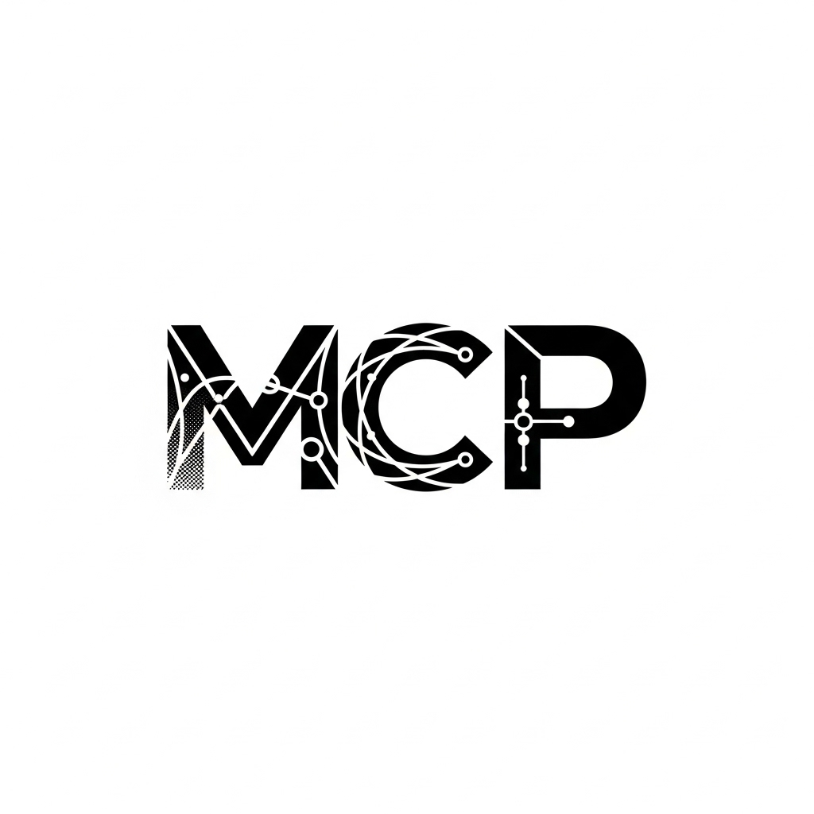

# Hi there, I'm Mauricio Cavallini 👋

[][website]
[][linkedin]
[][github]

## I'm a Father, Developer, Teacher, and Coach!!

Currently building EUDR compliance software for global supply chains at [Prewave][prewave].

- 👨‍👩‍👧 Proud father balancing family life with tech passion
- 🧠 Teaching emotional intelligence and personal development for 8+ years
- 🌱 Currently mastering cloud-native architectures and AI integration
- 👯 Looking to collaborate with teams that value both code quality AND people
- 🥅 2026 Goals: Launch more meaningful projects that impact education
- ⚡ Fun fact: I love philosophy, mindfulness, and believe the best code comes from emotionally intelligent teams
- 🎯 Master's in Personal Development & Values Leadership

### Languages and Tools

[][angular]
[][typescript]
[][react]
[][java]
[][spring]
[][kotlin]
[][nodejs]
[][nestjs]
[][postgresql]
[][docker]
[][azure]
[][git]
[][vscode]
[][storybook]

### 🌟 Current Projects

<table>
  <tr>
    <td align="center" width="50%">
      <h3>🌍 Supply Chain Intelligence @ Prewave</h3>
      

        Making <a href="https://www.prewave.com/solutions/eudr">EUDR</a> compliance workable at scale —
        EU <strong>TRACES</strong>-connected Due Diligence Statements,
        <strong>deforestation</strong> risk checks against the 2020 cutoff, and
        <strong>legality</strong> assessments that hold up under audit.
      

    </td>
    <td align="center" width="50%">
      <h3>🎓 La Akademia</h3>
      
Leading a non-profit educational organization focused on personal development

    </td>
  </tr>
</table>

### 🤖 AI & Modern Development

  
  
<strong>Exploring AI-Powered Development</strong>

  
Integrating Claude MCP and modern AI tools to enhance developer productivity and code quality

---

### 📊 GitHub Stats

<!-- Generated in-repo by .github/workflows/grs.yml — no third-party service at render time. -->

  

---

### 💡 My Values

> "I believe that exceptional results are only possible through genuine and honest relationships. The best code comes from teams that feel valued, heard, and inspired."

- 🤝 **Commitment**: 8 years dedicated to La Akademia's humanistic mission
- 💪 **Trust**: Self-taught professional confident in continuous learning
- ✨ **Truth**: Building genuine relationships for exceptional results
- 🌱 **Resilience**: Thriving through changes while maintaining a learner's mindset

---

### 📫 Let's Connect!

I'm always interested in:

- 🏢 Projects that value both technical excellence and team well-being
- 🧠 Opportunities to integrate emotional intelligence in tech teams
- 🌍 Collaborations that make a positive impact on education and society
- 💻 Innovative solutions using modern web technologies

**📧 [mauricio1acp@pm.me](mailto:mauricio1acp@pm.me)** &nbsp;·&nbsp; **🌐 [mauriciocavallini.com][website]** &nbsp;·&nbsp; **💼 [LinkedIn][linkedin]**

[website]: https://mauriciocavallini.com
[linkedin]: https://www.linkedin.com/in/mauriciocavalliniangularexpertdev
[github]: https://github.com/mauricioacp
[prewave]: https://www.prewave.com/
[angular]: https://angular.dev/
[typescript]: https://www.typescriptlang.org/
[react]: https://react.dev/
[java]: https://dev.java/
[spring]: https://spring.io/
[kotlin]: https://kotlinlang.org/
[nodejs]: https://nodejs.org/
[nestjs]: https://nestjs.com/
[postgresql]: https://www.postgresql.org/
[docker]: https://www.docker.com/
[azure]: https://azure.microsoft.com/
[git]: https://git-scm.com/
[vscode]: https://code.visualstudio.com/
[storybook]: https://storybook.js.org/
